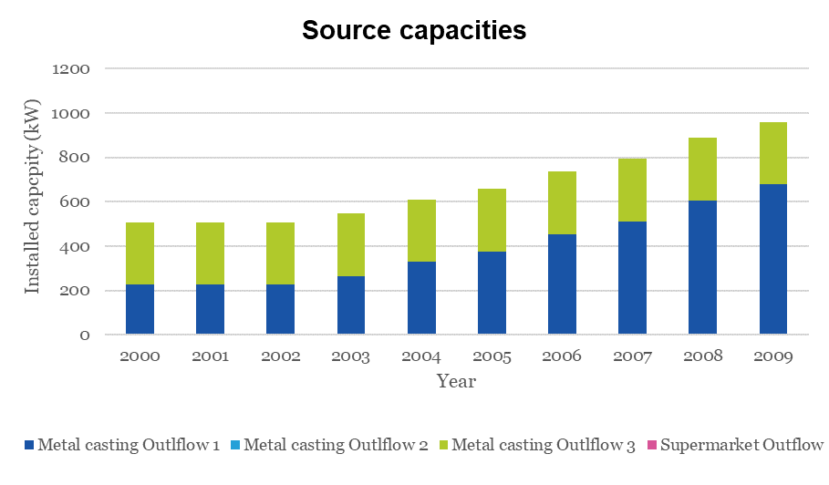

=================================
Results from the TEO
=================================
The techno-economic optimisation module should provide the following results:

The technology mix (in terms of existing and newly installed yearly capacities in terms of energy flows throughout the supply-demand chain)

The installed capacities at the different sources is shown in Figure below. The model only uses 2 source outflows from the Metal casting industry. The excess heat from the      supermarket is not used use due to the low temperatures and thus needs expensive investments. 

              
              Source capacities
    
 
