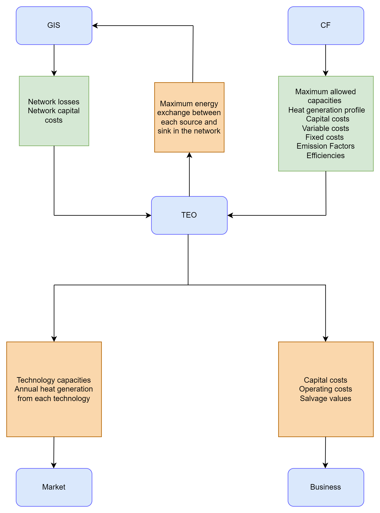
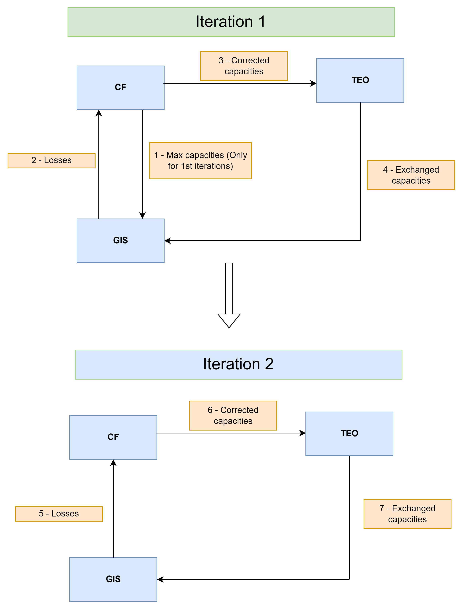

===================================
Links to other modules
===================================
This section describes the links between the TEo and the other modules in the EMB3RS platform. 

The TEO module is linked to all the modules in the EMB3RS. The module obtains inputs from the CF module, has a two-way input-output link with the GIS module and provides inputs for the market and business modules. 

The below figure shows the inputs to the TEO and the outputs from the TEO to the modules. 

The CF accesses the emission factors, limits and penalties from the regulatory framework. These are then passed to the TEO. 

The TEO module is linked to the GIS and CF module to design the capacities of the heat generation technologies and the heating network. The outputs from TEO are given to the GIS module for the iterative process. Other than this, the output from the TEO module provides some inputs to the market and business module. 
The iteration between the TEO, the CF and the GIS modules will take place in two steps. In the first step, the GIS module will provide values for DHC costs and average network losses considering all possible connections in the network. The losses in the network consist both of energy and exergy losses. The CF module calculates the maximum possible heat generation capacities at the sources based on the temperature availability. To compensate for the exergy losses, the technologies on the source side must produce heat at higher temperatures. The CF module will account for the exergy losses and calculate the maximum possible heat generation capacities for all the sources side technologies. In some cases, additional temperature-boosting technologies such as heat pumps would be needed to overcome the exergy losses. The CF will provide the corrected maximum capacities of the technologies to the TEO.  TEO will then determine the least cost matching of sources and sinks considering the energy losses in the network. Since the loss values from the GIS are as power losses (in terms of kW), these losses are added to the sink demand in each hour. The TEO then determines the optimal matching of sources and sinks. Based on this, the exchange capacities between the sources and the sinks i.e. the maximum exchange between each source and sinks are calculated. The exchange capacities indicate the hourly heat flow from each source to each sink in the network. The maximum hourly heat exchange between each source and sink will be used by the GIS module to design the pipe capacities in the district heating network. The sources and the sinks in the network and maximum hourly heat exchange between each source and sink will be fed back to the GIS. In Some cases, the TEO might discard certain sources due to the lack of profitability. This information is also passed on to the GIS module.  

In the second step, the GIS will use the calculated maximum exchange capacities to determine the accurate losses and the investments costs of the DHC. These losses are once again fed into the CF to determine the corrected maximum capacities accounting for the exergy losses and forward this information to the TEO. These results are then fed into the TEO to obtain the accurate least-cost mix of technologies. A schematic of the iteration is shown in figure below.

TEO-CF-GIS iterations.

In every iteration, the loss value from the GIS is monitored and used as a critical value of stopping the iteration. When the difference in the loss values in two consecutive iterations is below 0.01%, the iterations are stopped. 

The market and business module directly use the TEO results. The market module uses the installed capacities of the different technologies to calculate the dispatch from each technology. The business module uses the capital investment and operation and maintenance costs of the different technologies and storage, and the salvage values to analyse the financial feasibility of the project. 

