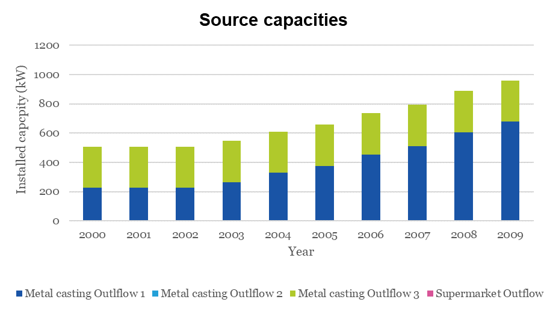
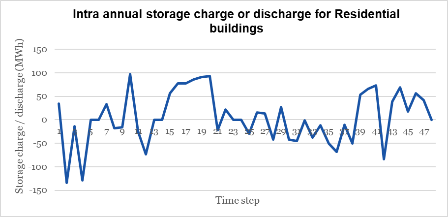

=================================
Results from the TEO
=================================
If run correctly, the Test Case will provide the results shown in the following. Note that these results are only a selection of the key outputs, condensing some of the important insights. Outputs for all the ‘variables’ listed in the previous sub-sections are calculated. They can also be extracted and visualised.

The technology mix (in terms of existing and newly installed yearly capacities in terms of energy flows throughout the supply-demand chain)

The installed capacities at the different sources is shown in Figure below. The model only uses 2 source outflows from the Metal casting industry. The excess heat from the      supermarket is not used use due to the low temperatures and thus needs expensive investments. 

              
Source capacities

The installed capacities at the different sinks is shown in the Figure below. The sinks capacities are based on the sink demand. As the demand grow over the years, the capacity is also increased. 

.. figure::  Documents/Images/Sink_capacities.png
   :align:   center
   
Sink capacities
            
The installed capacities of storages is shown in the Figure below. The model only installs storages at the sink site since it is easier to control installed capacities in the DHN if the storage is located after the DHN. The storage capacities are also based on the sink demand. As the demand grow over the years, the storage capacity is also increased. 

 
.. figure::  Documents/Images/Storage_capacity.png
   :align:   center

Installed capacity of storages
              

The Intra annual heat generation from sources is shown in the Figure below. The heat generation from the sources does not follow the demand profile due to the storages in the system. We see that the heat generation is constant in most time steps and there are drastic variations in a few TimeSlices.  This is because of the charging and discharging from the storage which is seen next.       
       
 
.. figure::  Documents/Images/Intra_annual_heat_generation_from_sources.png
   :align:   center
   
Intra annual heat generation from sources

The Intra annual storage charge or discharge for Residential buildings is shown in Figure below. The storage is continuously cycled according to the sink demand profiles.     

 

   
Intra annual storage operation

Annual costs (investment, fuel, operation & maintenance) associated with the technologies for the sources and the sinks is shown in the Figure below.
  

.. figure::  Documents/Images/Invetsment_cost.png
   :align:   center
   
Investment Costs

The operation and maintenance costs of the sources and the sinks is shown in the Figure below.        

.. figure::  Documents/Images/Operating_cost.png
   :align:   center

Operating costs
