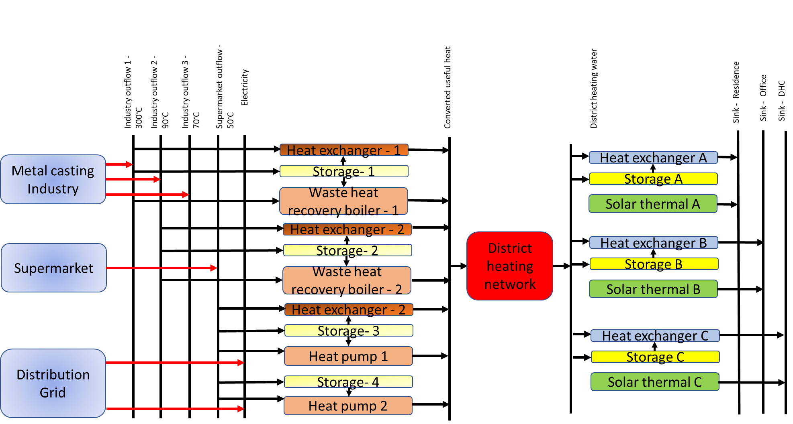

===================================
Running a test case
===================================

Description of the test case
--------------------------------------

This section introduces the user to the basic components of any application of TEO and describes the steps for the creation of a model. To this end, a sample case study is used and examples from it are shown throughout the section. 

The sample case study for TEO, represents a case of industrial excess heat recovery and use. The simple use case consists of two excess heat producers Supermarket and Metal casting Industry and three sink points District Heating and Cooling grid (DHC), office buildings and residential buildings. The excess heat load profiles for the source and sink points are be used. The boundaries of the system represented in the case study are shown in the schematic representation shown in the figure below.

   					

		

					
				
				
				
				
				
				
				
				
				
				
				
				
				
				
				
				
	
	
	
	
	
	
				
				
				
				
				
				
				
				
				
				
				
				
				
				
				
				
				
				
				
				
				
				
				
				
				
				
				
				
				
				
				
				
				
				
				
				
				
				
				
				
				
				
				
				
				
				
				
				
				
				
				
				
				
				
				
				
				
				
				
				
				
				
				
				
				
				
				
				
				
				
				
				

:align:   center The Reference Energy System (RES) of the Simple case study.

In the RES, the rectangles represent the technologies, the arrows represent the flow of energy and the vertical lines represent fuels. The RES is read from the left to the right. The primary energy supply side is on the left and the final energy demand side is on the right. The source nodes, metal casting industry and the supermarket, are modelled as technologies, whereas the sink nodes, being residential buildings, office buildings and DHC are modelled as fuels. The distribution grid has also been added as a technology as some components can either require or produce electricity. For the test case, the heat pumps in the system will require electricity to operate. The first set of vertical lines represent fuels at the primary level. These primary fuels consist of electricity, waste heat from the outflows of the metal casting industry at three different temperatures, and waste heat from supermarket. The waste heat from each source is supplied to a set of technologies. Here, we assume a Heat Exchanger (HE), Waste Heat Recovery Boiler (WHRB) for the first waste heat outflow from the industry. Similarly, the second outflow makes use of a HE and a WHRB. The third outflow is provided to a Heat Pump (HP) and a HE. The supermarket waste heat is provided with a HP.

The outflow temperatures of the metal casting industry are to be at 300°C, 90°C and 70°C Celsius for its three outflows whereas the waste heat from the supermarket is at 50°C. On the sinks’ side, the DHC demand temperature is the same as the average supply temperature of the DHN, which is at 90°C. The demand temperature profile of the office buildings is the same as that of the residential buildings at 90°C. The sources and the sinks are equipped with storages. This implies that the generation and supply technologies be connected to a storage technology, and also, the demand technologies be connected to storage systems.

Only one storage can be chosen for a set of technologies. Here, each technology is connected to a storage option. Based on the technology that is selected from the optimization process, the energy will be stored from the technology in the corresponding storage.The technologies are assessed for feasibility and selected in the process. The converted useful heat at the suitable temperature (here, the network temperature) is stored and also supplied to the secondary fuel level. 

The secondary level fuel is the converted useful heat. The converted useful heat is then supplied to the District Heating Network, which is modelled as a technology. The network is similar to the distribution grid being modelled as a technology, and they both account for losses. The heat from the network is supplied to all demand points by first being transformed into a tertiary level fuel of district heating water. To further assess the feasibility of the demand side system, solar technologies have been added. Solar thermal technologies have been added to all sinks.

Data and instruction to run the model
------------------------------------------------------

The input file for the prototype is ‘Input_file_TEO.xlsx’, which can be accessed at ‘LINK’. To run the TEO, the code files named ‘TEO_Model’, ‘TEO_functions’, TEO_running_file’, and the input file must be downloaded and saved in a specific manner. A main folder called ‘TEO’ must be created and the code will be downloaded into this folder. Within this main folder, two sub folders named ‘Input_data’ and ‘Output_data’ must be created. The input file must be saved into the ‘Input_data’ folder. A representation of how the files must be organised is shown below.

 TEO (Main folder)

	o Input_data

		 Input_file_TEO.xlsx

	o Output_data

	o TEO_Model

	o TEO_functions

	o TEO_running_file

Once the TEO analyses in completed, the results file named ‘Input_file_TEO_Results.xlsx’ will be save in ‘Output_data’ sub-folder. Once the files are downloaded and the folder structure is established, the model can be run using the TEO_running_file. The name of the input directory and the input file must be checked in the TEO_running_file. Since the name of the input file is to be checked and altered, it is advisable to open the TEO_running_file in a python IDE or a in other python notebook interface such as ‘Jupyter lab’ or ‘Visual studio code’. Both these are freeware and can be downloaded. The TEO module can output results in two formats, excel and csv. The preference for the output format can also be set in the TEO_running_file by specifying a ‘True’ or ‘False’ next to the output formats in the TEO_running_file.

Note on the solvers
------------------------------

Two solvers, GLPK (GNU linear programming kit) and CBC (Coin-or branch and cut) are inbuilt in the PULP. In order to use other solvers, they should be downloaded and installed. Instruction for this can be found at ‘https: //coin-or.github.io/pulp/guides/how_to_configure_solvers.html’. After the installation of the solver, the solver path needs to be added as an environment variable and then should be called into python using solver commands. The user can analyse the data based on the results saved in the output file. The user can also use other solvers such as CPLEX and Gurobi to run the TEO. The solver name and path must be specified in the TEO_running_file.

